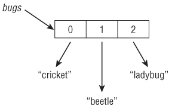
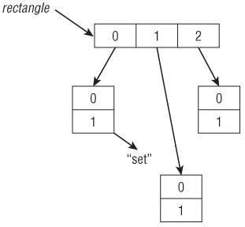
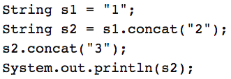

<!--
$theme: default
page_number: true
footer: Java Class - Class 5
-->
# Class 08 - Ammon Gruwell

- Arrays
- Strings
- Reference vs. Primitive
- Equality
- Wrapper Classes
- Varargs
-----------------------------------------------------------------------------
# Arrays

- An Array is an ordered list of items
  - {15, 31, 7}
  - {'a', 'g', 'x'}
- The items in the list are numbered starting at 0

- Arrays initialize to 0
- Arrays may contain duplicates
-----------------------------------------------------------------------------
# Creating An Array

- int[] numbers = new int[3];
  - Creates new array with three elements named my_array
  - Each element is initialized to 0
  - What type is the variable "numbers"?
  - What type goes into this array?

-----------------------------------------------------------------------------
# Creating An Initialized Array

- int[] myNumbers = new int[] {42, 55, 99};
- int[] numbers2 = {42, 55, 99};
  - When initializing, we can leave off the "new int[]" part

-----------------------------------------------------------------------------
# Creating An Array: Syntax

- Which of these is valid Java syntax?
  - int[] myArray1;
  - int [] myArray2;
  - int myArray3[];
  - int myArray4 [];

-----------------------------------------------------------------------------
# Creating An Array of Objects

- String[] bugs = {"cricket", "beetle", "ladybug"};
- Array only contains references to the objects, not the objects themselves

- In the following example, what does each item in the list initialize to?
  - String[] foods = new String[5];
-----------------------------------------------------------------------------
# Using Arrays

- String[] animals = {"tiger", "kangaroo", "shark"};
- System.out.println(animals[0]); // tiger
- System.out.println(animals[2]); // shark
- System.out.println(animals.length); // 3

-----------------------------------------------------------------------------
# Practice!
- Open up Multiples.java
-----------------------------------------------------------------------------
# Array Review
- How do you get the length of an array?

-----------------------------------------------------------------------------
# Array Review
- How do you get the length of an array?
  - int len = myArray.length;

-----------------------------------------------------------------------------
# Array Review
- How do you initialize an array?

-----------------------------------------------------------------------------
# Array Review
- How do you initialize an array?
  - char[] myChars = {'w', 'g', 'b'};

-----------------------------------------------------------------------------
# Multidimensional Arrays
- Arrays can have more than one dimension
- String[][] rectangle = new String[3][2];

-----------------------------------------------------------------------------
# Practice!
- Open up TwoDimArray.java
-----------------------------------------------------------------------------
# Strings
- A sequence of characters
- String myName = "Ammon";
  - Is this a primitive type?
  - If not, why no "new" keyword?

-----------------------------------------------------------------------------
# String Concatenation
- System.out.print("abc" + "de"); //abcde
- System.out.print(99 + " red balloons"); //99 red balloons
- System.out.print(9 + 9 + " red balloons"); //18 red balloons

-----------------------------------------------------------------------------
# String Concatenation Rules
- Rules to follow when concatenating:
  - When "adding" two numbers use numeric addition
  - Use string concatenation otherwise
  - Go left to right

-----------------------------------------------------------------------------
# String Immutability
- Mutable = changeable
- An immutable object is one that can't be changed once it is created
- Strings are immutable

-----------------------------------------------------------------------------
# String Immutability
- What does the following code print out?

-----------------------------------------------------------------------------
# Object Reference vs. Primitive

-----------------------------------------------------------------------------
# Value Equality vs. Identity Equality

-----------------------------------------------------------------------------
# Wrapper Classes

-----------------------------------------------------------------------------
# Varargs

