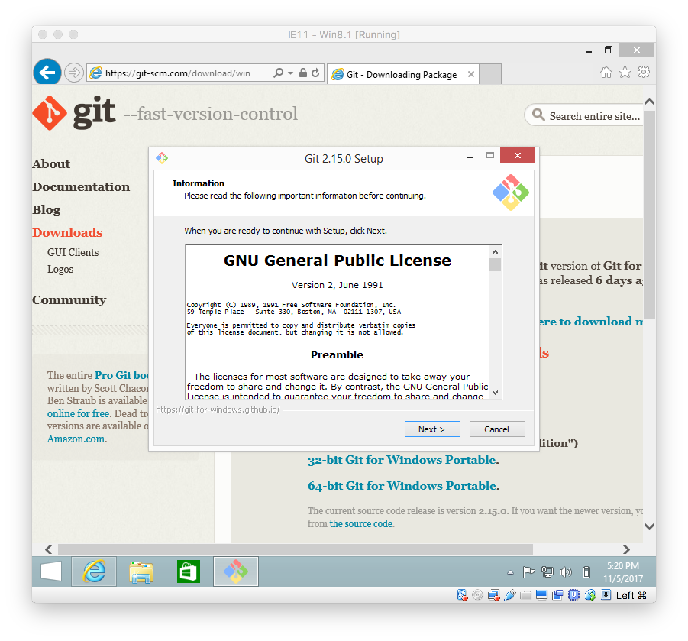
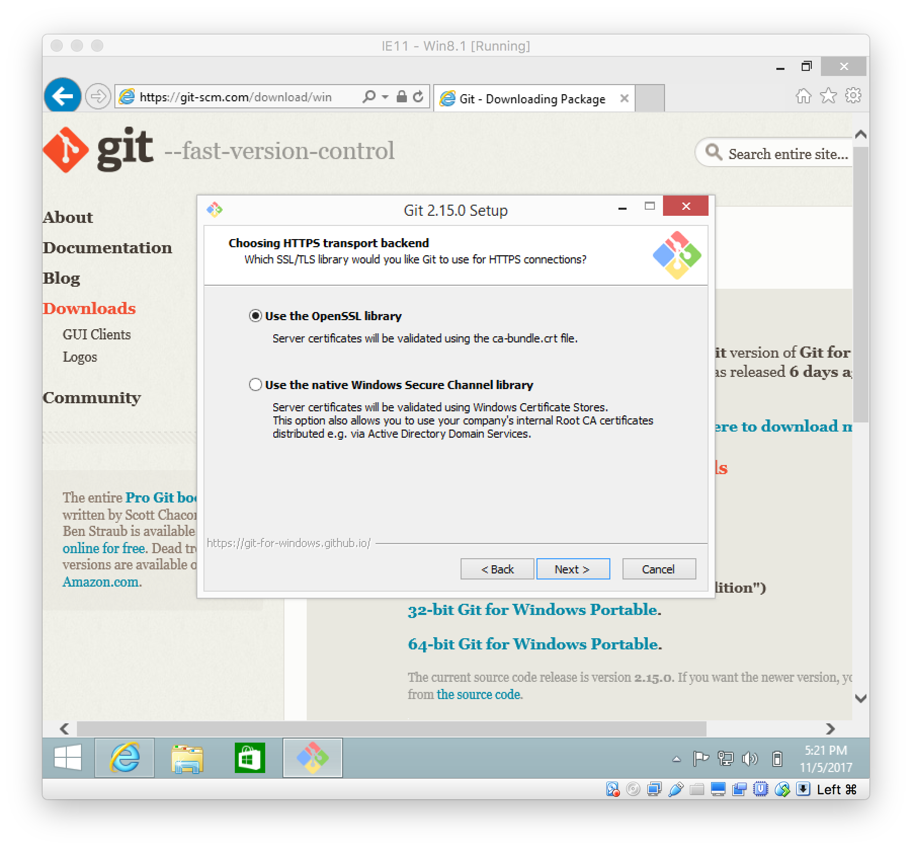
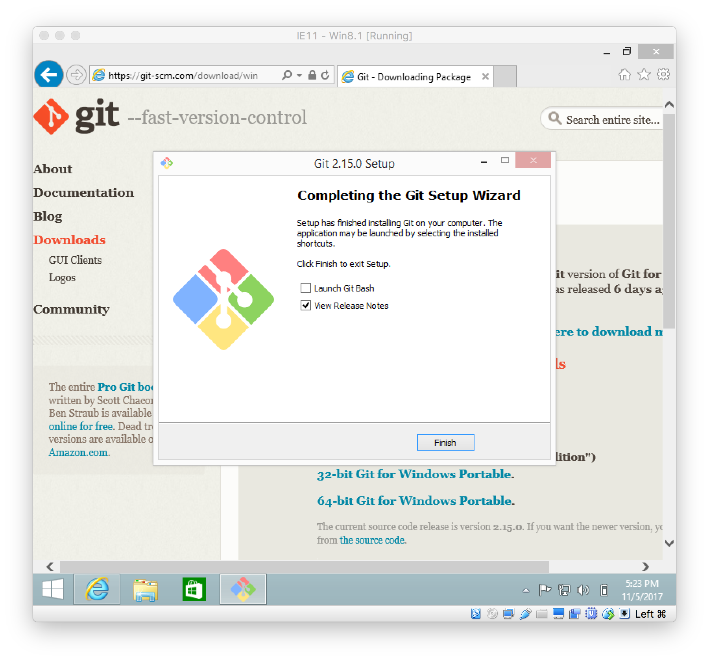
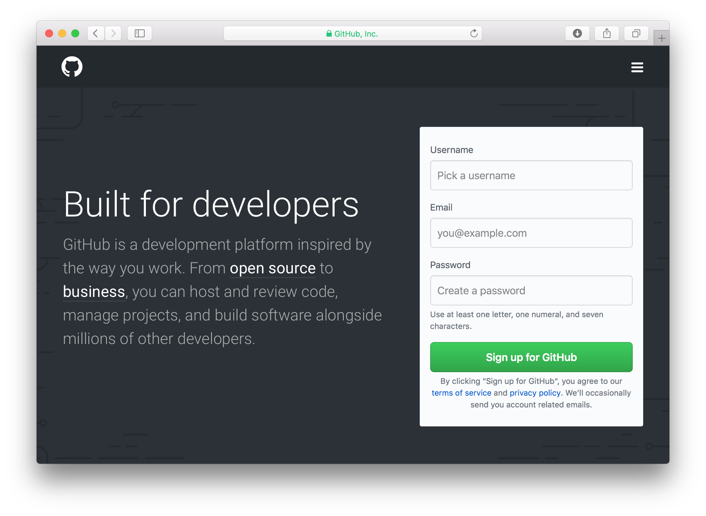
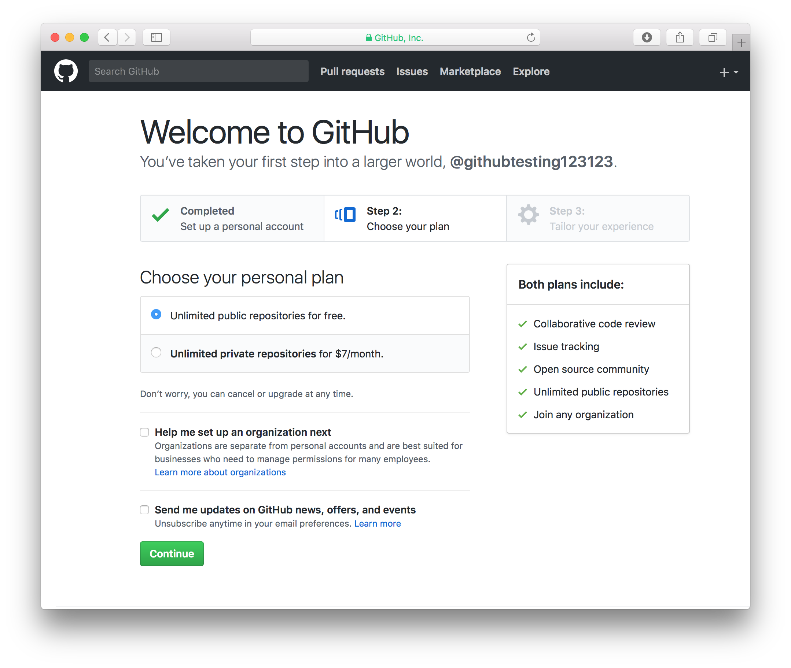
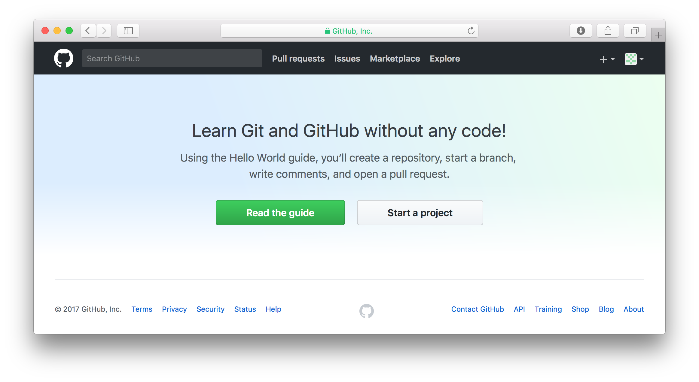

<!--
$theme: default
page_number: true
footer: Java Class - Module 6
-->

# Module 6

- **Git introduction.**
- **GitHub account creating**
- **Using Git and GitHub for class projects**
- **Project #1 introduction**

-----------------------------------------------------------------------------

# Project?

Instead of homework assignments this week, let's do a project! Let's start putting what you've been learning to use by building a database.

We'll use conditionals (`if` statements), loops (`for` statements), different data types (`String`, `int`, etc.), multiple classes and methods -- so everything we've gone over so far.

-----------------------------------------------------------------------------

# Git?

Git is a program that allows you to track updates in your code and easity share it as well. Git is heavily used in jobs and large projects, so we will use it to use to submit this and all future class projects.

-----------------------------------------------------------------------------

# Git

- A better way to "undo" changes,
- A better way to collaborate than mailing files back and forth, and
- A better way to share your code with your teammates and the world.

-----------------------------------------------------------------------------

# What is GitHub?

GitHub is a site where you can host your code for free after you create an account. It is a place where anyone can search, browse, download, and use Open Source software. It doesn't *run* your code, but it just *stores* it.

-----------------------------------------------------------------------------

# New Terminology

==**Open Source**==: Any software whose source code (like the Java code you write) is freely available.

-----------------------------------------------------------------------------

# Git + GitHub = Dropbox for your code

-----------------------------------------------------------------------------

# Git and GitHub can do a lot, but this is where we'll start:

- How to save your work in your own computer.
- How to save your work in your GitHub account.

-----------------------------------------------------------------------------

# What's next

1. Install Git.
2. Signup for GitHub.
3. Create a space in your GitHub account to store the first project.
4. Git commands you'll need to know.

-----------------------------------------------------------------------------

# Installing Git

Go to https://git-scm.com/download and select the operating system that you're using. If you're on Windows, make sure you know if you have 32 or 64 bit versions. The next slides are screenshots of installing Git in Windows.

-----------------------------------------------------------------------------


-----------------------------------------------------------------------------


-----------------------------------------------------------------------------



-----------------------------------------------------------------------------


-----------------------------------------------------------------------------


-----------------------------------------------------------------------------


-----------------------------------------------------------------------------


-----------------------------------------------------------------------------



-----------------------------------------------------------------------------


-----------------------------------------------------------------------------


-----------------------------------------------------------------------------


-----------------------------------------------------------------------------



-----------------------------------------------------------------------------

# Now open your terminal and run `git`.
# What do you see?

-----------------------------------------------------------------------------


-----------------------------------------------------------------------------

# Configure Git

Let's give Git your name and email so that it knows who you are.

```
> git config --global user.name "FirstName LastName"
> git config --global user.email "YourEmailAddress"
```

-----------------------------------------------------------------------------

# Next let's create a GitHub account

Now that you have Git installed in your computer, we're going to create a GitHub account so that you can store your code in both your computer and online. Go to https://github.com to start the process.

-----------------------------------------------------------------------------



-----------------------------------------------------------------------------



-----------------------------------------------------------------------------


-----------------------------------------------------------------------------



-----------------------------------------------------------------------------


-----------------------------------------------------------------------------


-----------------------------------------------------------------------------


-----------------------------------------------------------------------------

# New Terminology

==**Repository**==: repositories are where you store your Git projects. They track the code and have a history of all of the updates.

-----------------------------------------------------------------------------

# Git commands

- `git add`
- `git commit`
- `git push`
- `git clone`

-----------------------------------------------------------------------------

# `git add`

-----------------------------------------------------------------------------

# `git commit`

-----------------------------------------------------------------------------

# `git push`

-----------------------------------------------------------------------------

# Cloning your repository with `git clone`

-----------------------------------------------------------------------------

# Making a change and pushing it to GitHub

-----------------------------------------------------------------------------

# Additional resources

-----------------------------------------------------------------------------

# Reference list
