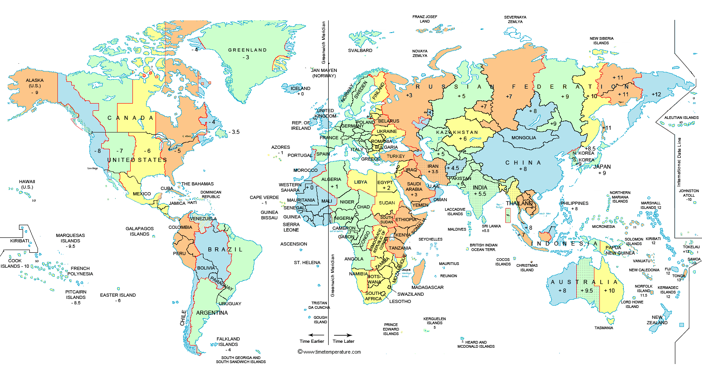

# Dates and Times

Almost all software uses dates and times. It is important to know how to use them.

Dates and times work differently in Java 8 compared to previous versions.

If you search on the internet, you may find examples that use older code based on Java 6 or 7. **Do not use** these in your programs or in the exam.

__Book__: Chapter 3, pages 138 to 152

---

# What is a Date?

A date represents a <u>day</u>. It can be any day in the past, in the future, or today.

## Here is a date: <u>2018-01-27</u>

See how Java represents a date: <u>YYYY-MM-DD</u>

To use a date: [`java.time.LocalDate`](https://docs.oracle.com/javase/8/docs/api/java/time/LocalDate.html)

---

# What is a Time?

A time represents a <u>time of day</u>, between midnight and 11:59:59pm

## Here is a **time**: 14:30:45

See how Java represents a time: HH:MM:SS.
Java uses a <u>24-hour clock</u>, so 2PM is 14:00

To use a time: [`java.time.LocalTime`](https://docs.oracle.com/javase/8/docs/api/java/time/LocalTime.html)

---

# Date and Time together

Very often, you want <u>both a date and a time</u> in one.

## This is a DateTime: `2018-01-27T14:30:45`

See how Java represents a date and time: a <u>capital letter T</u> between the date and the time parts.

Use a date/time: [`java.time.LocalDateTime`](https://docs.oracle.com/javase/8/docs/api/java/time/LocalDateTime.html)

--- 

# Common Operations

## Right now: `.now()`
To create a <u>new date or time object</u> with the current date or time.

This works on all classes:

```java
LocalDate d = LocalDate.now();
LocalTime t = LocalTime.now();
LocalDateTime dt = LocalDateTime.now();
```

--- 
# Common Operations

## A specific date or time: `.of()`
To create a <u>new date or time object</u> with a specific date or time.

```java
LocalDate yesterday = LocalDate.of(2017, 1, 26);
LocalTime noon = LocalTime.of(12, 0);
LocalDateTime l = LocalDateTime.of(2017, 1, 26, 12, 0);
```

You can also <u>combine a date and time object</u> to create a `LocalDateTime`: 

```java
LocalDateTime l2 = LocalDateTime.of(yesterday, noon);
```
<big>❓</big>How do we create an object that represents midnight?
<big>❓</big>How do we create an object that represents tomorrow, 3pm?

---

# Older ways

There are a lot of examples on the internet that use older ways of using dates and times. **<u>Do not use these</u>**.

```java
//DO NOT USE!
Date d = new Date();
Calendar c = Calendar.getInstance();
```


The book has more examples of old ways to create dates and times.

---

# Adding and Subtracting

Methods to <u>add and subtract dates and times</u> are named `minus` and `plus` followed by the unit (Seconds, Days, Weeks), like this:

```java
LocalDate d = LocalDate.now();
//Add a year
LocalDate nextYear = d.plusYears(1);
// Subtract two months
LocalDate fourMonthsAgo = d.minusMonths(4);
// Add two weeks
LocalDate twoWeeksFromNow = d.plusWeeks(2);
// Subtract a day
LocalDate yesterday = d.minusDays(1);
```

You can use these on `LocalDate`, `LocalTime` and `LocalDateTime`. 

<big>❓</big>How would you subtract three hours from a `LocalTime` object?
<big>❓</big>What happens when you call `.addMinutes(1)` on a `LocalDate` object?

--- 

# Practice

Write a small program that prints your next birthday.

<u>Extra</u>: Also print the day of the week of your next ten birthdays.

The output should look like this:

```text
My birthday is on 1972-12-07
My next 10 birthdays: 
2018: FRIDAY
2019: SATURDAY
2020: MONDAY
2021: TUESDAY
2022: WEDNESDAY
2023: THURSDAY
(...)
```

_Hints: Use a `for` loop. Look up the `getDayOfWeek()` method._

--- 

# Periods

A `Period` is a specific length of time. Defining periods makes your code more readable and reusable.

```java
Period aYear = Period.ofYears(1);
Period aQuarter = Period.ofMonths(3);
Period oneMonthAndFourDays = Period.of(0, 1, 4);

LocalDate d = LocalDate.now();
LocalDate nextYear = d.plus(aYear);
```

<big>❓</big>How would you create a `Period` of 2 weeks, 3 hours, 20 seconds?

---

# The Real World

In the real world, we do not write dates as `2018-01-27` but as `1/27/2018` or `January 27, 2018` (in the United States).

To represent dates and times in 'human readable` format, we use a **Formatter**.


`LocalDate`
`LocalTime` ▶▶▶▶▶▶ **Formatter** ▶ Human readable time / date
`LocalDatetime`

---

# Formatting dates and times

We must first define a Formatter:

```java
DateTimeFormatter shortF = 
DateTimeFormatter.ofLocalizedDateTime(FormatStyle.SHORT);`
```

Then apply it to a date or time object:

```java
LocalDateTime now = LocalDateTime.now();
System.out.println(shortF.format(now));
// This will print: 1/24/18 2:42 PM
```

---

# Extra: Other useful methods

If you want to determine if one date / time is before or after another: `.isbefore()` / `.isAfter()`

If you want to know the `Period` since or until another date / time: `.until()` / `since()`

```java
LocalDate now = LocalDate.now();
LocalDate christmas = LocalDate.of(2018, 12, 25);
Period untilChristmas = now.until(christmas);
```

---

# Extra: Method Chaining

A pattern that is used a lot in Java is **method chaining**.

Method chaining is calling several methods in the same statement: `thing.doThis().thenThat().thenSomethingElse()`

We can use this with the add / subtract methods as follows:

```java
LocalDateTime l = LocalDateTime.now();
LocalDateTime someTime = l.plusYears(1).minusDays(1);
```
<big>❓</big>What date / time will `someTime` be now?

--- 

# Extra: What about time zones?

We learned about using **Local** times and dates. This is all you need for the exam, and many real world uses. It is possible to work with time zones in Java, but we will not cover this in class.


