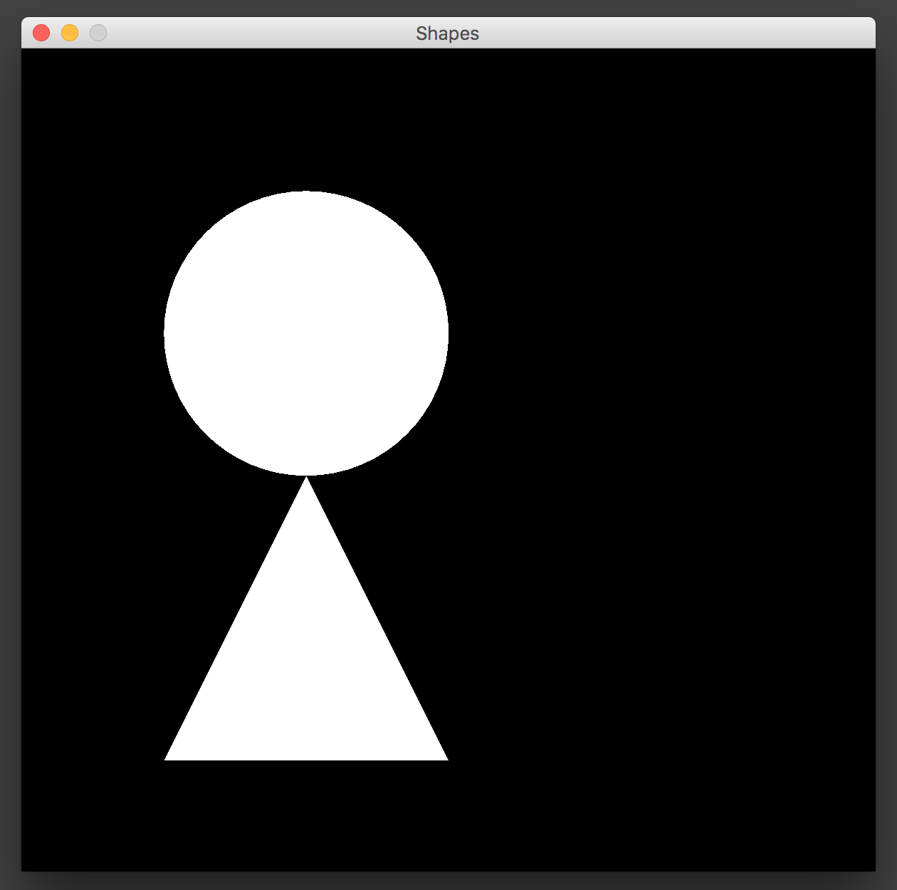
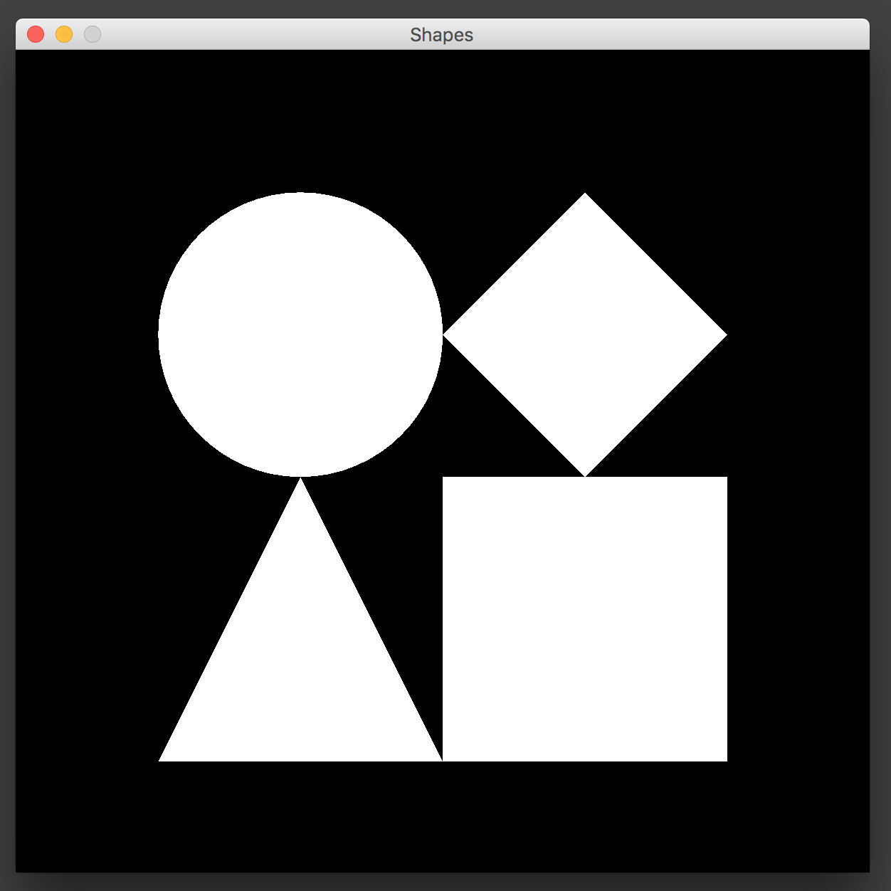

# Module 12 Homework

<style>
@media print {
  pre {
    border: 1px solid gray;
    page-break-inside: avoid;
  }
}

.break {
  page-break-after: always;
}
</style>
-----------------------------------------------------------------------
#### 1. Different kinds of shapes

Start in the code in the `shapes` folder. Compile and run the `Main` class and you will see a window appear with some shapes inside of it. You will see a circle and a triangle. These shapes use the `Circle` and `Triangle` classes, which both inherit from the `CanvasShape` class.



Your job is to make two new classes, `Square` and `Diamond`, that both inherit from the `CanvasShape` class just like the other shapes. To do this, you will need to write a constructor method and a `render` method. Next, you will need to add the shapes to the list in `Main`, with the right X and Y coordinates.

When you are finished, you should see a picture like this:



Hints:

- The [`drawRect`](https://docs.oracle.com/javase/8/docs/api/java/awt/Graphics.html#drawRect-int-int-int-int-) method will draw a rectangle or a square.
- The diamond is more tricky because you need to use the `GeneralPath` class. See the `Triangle` class for an example of how to use it.
- If you get stuck, use the `Circle` and `Triangle` classes as examples!

--------------------------------------------------------------------------

#### 2. It's a Zoo!
Consider the Sheep and Cow subclasses that inherit from the base class Animal. All of these classes print two simple properties of the of animals: their name and sound. Do the following:

A) Compile and run both the Sheep and Cow classes. The sheep class does not properly override the default sound, make it so it does. (notice how the sheep effectively accesses two different variabled titled ```sound```, this works as they are on different class levels)

--------------------------------------------------------------------------

#### 2. It's a Zoo! (cont.)
B) Add a new datamember to the Animal class(weight, color, height, whatever) with it's own getter method. Make it be declared when the constructor is called of the Animal class, adjust the constructors of all the subclasses to reflect that change (as well as where those constructors are called in their individual main methods)

Finally, call the getter method of the animal class on the subclass object so that it prints to the console.

-------------------------------------------------------------------------

#### 2. It's a Zoo (expected outputs for A and B)
A) Make the sheep class output: (must be called with the overridden method)
```
Name: Shelly
Sound: Baahahaa
```
B) One of your animals displays your new datamember when the it's main method is run
```
// A cow
Name: beefy
Sound: Moo...
Weight: 1400 pounds
```
-------------------------------------------------------------------------

#### 2. It's a Zoo! (cont.)
C) Create a broad class that inherits from Animal that can have its own subclasses (Fish, Dog, Cat, Bird, etc.) Create 3 subclasses off of that one. 
 * (ie: Animal -> Dog -> [Beagle, Poodle, Hound]). 
 
 Make all of these have a main method that displays their name and sound. Add a String labeled ```type``` (Fish/Dog/Bird/etc.) and make all 3 of the children print to console that type 
 ```java
 //eg: a Hound class that inherits from the Dog class
 System.out.println("Type: " + hound.getType());
 // this will return Dog
 ```
 
 -----------------------------------------------------------------------
 
#### 2. It's a Zoo! (cont.)

D) Test that all 3 of the subclasses from part C work. They should be able to print 4 different datamembers now, below is an example:
```
  // The parrot class inherits from some bird class
  public static void main(String args[]){
// The constructor takes 2 arguments now, name and color
// Color is declared in the parent Animal class
    Parrot greeny = new Parrot("greeny", "green");
    System.out.println("Name: " + greeny.getName());
    System.out.println("Sound: " + greeny.getSound());
    System.out.println("Color: " + greeny.getColor());
    System.out.println("Type: " + greeny.getType());
  }

```
------------------------------------------------------------------------