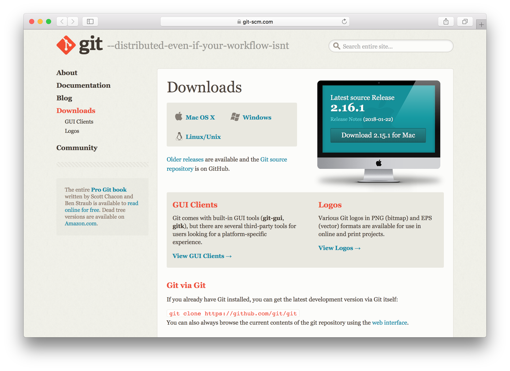
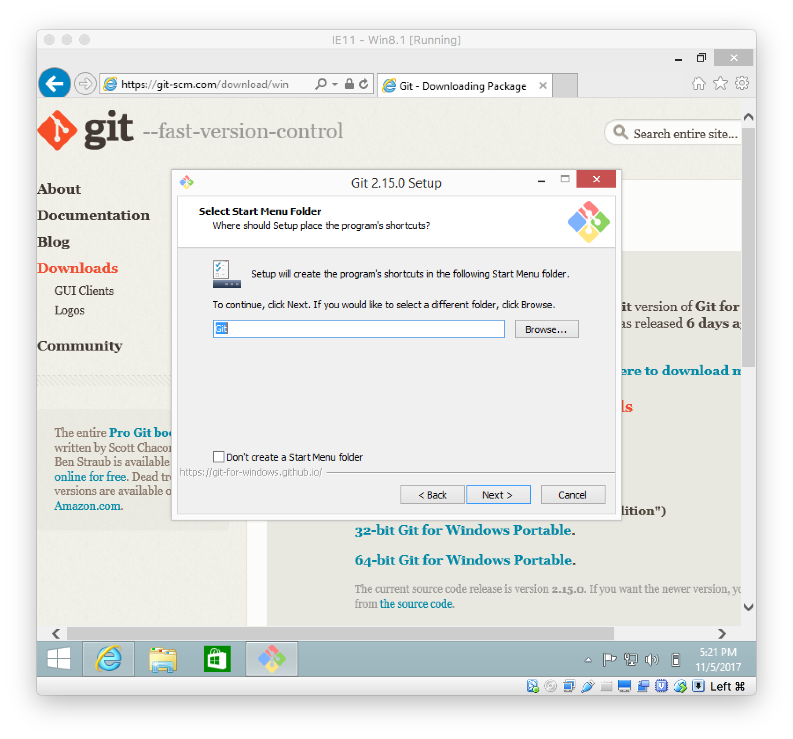
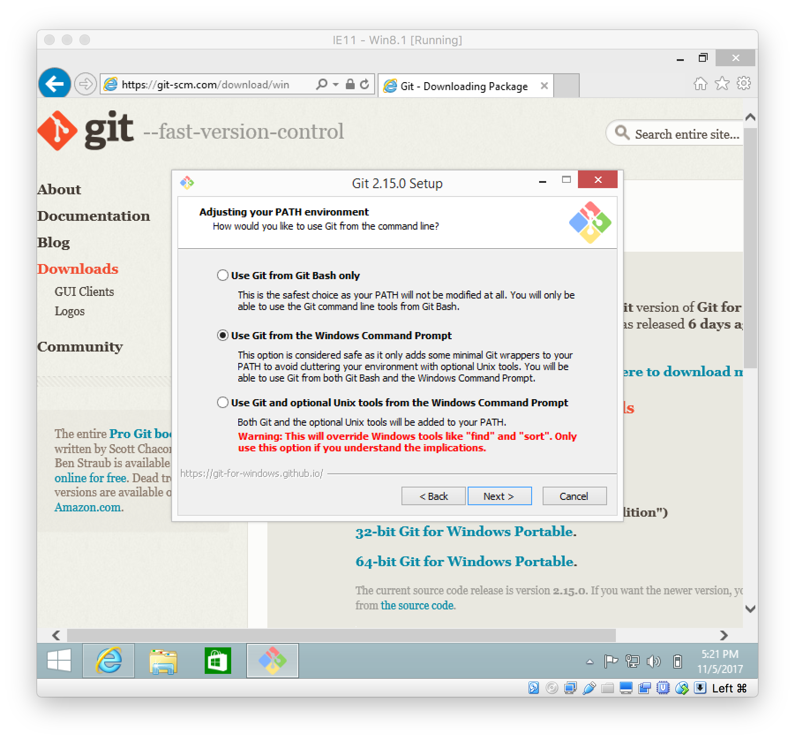
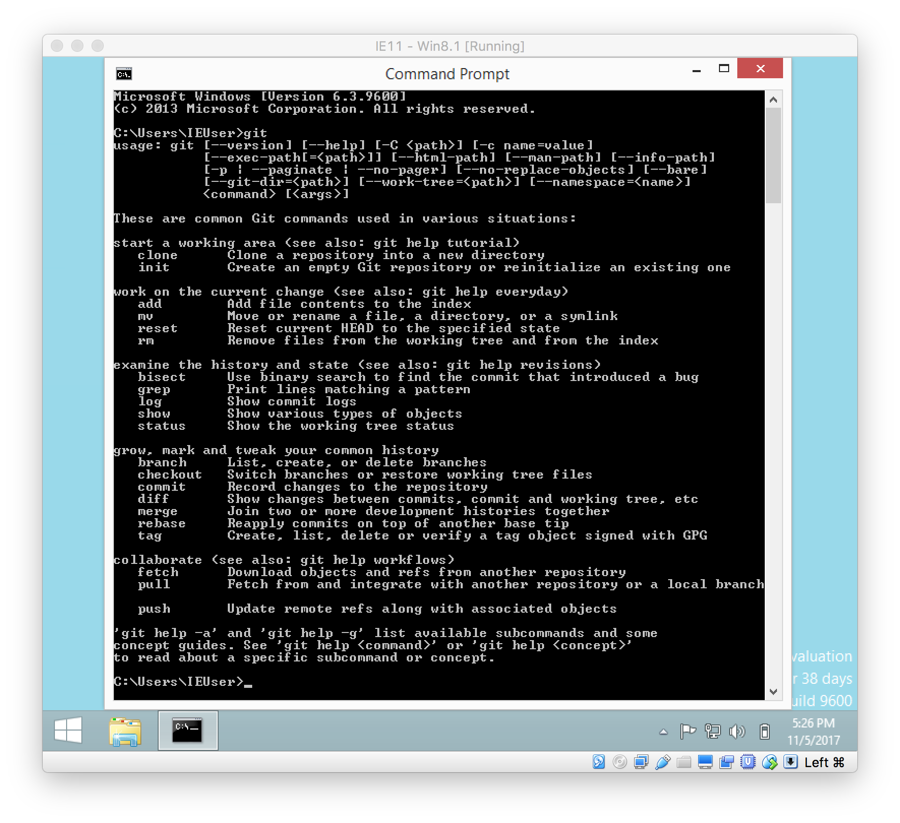
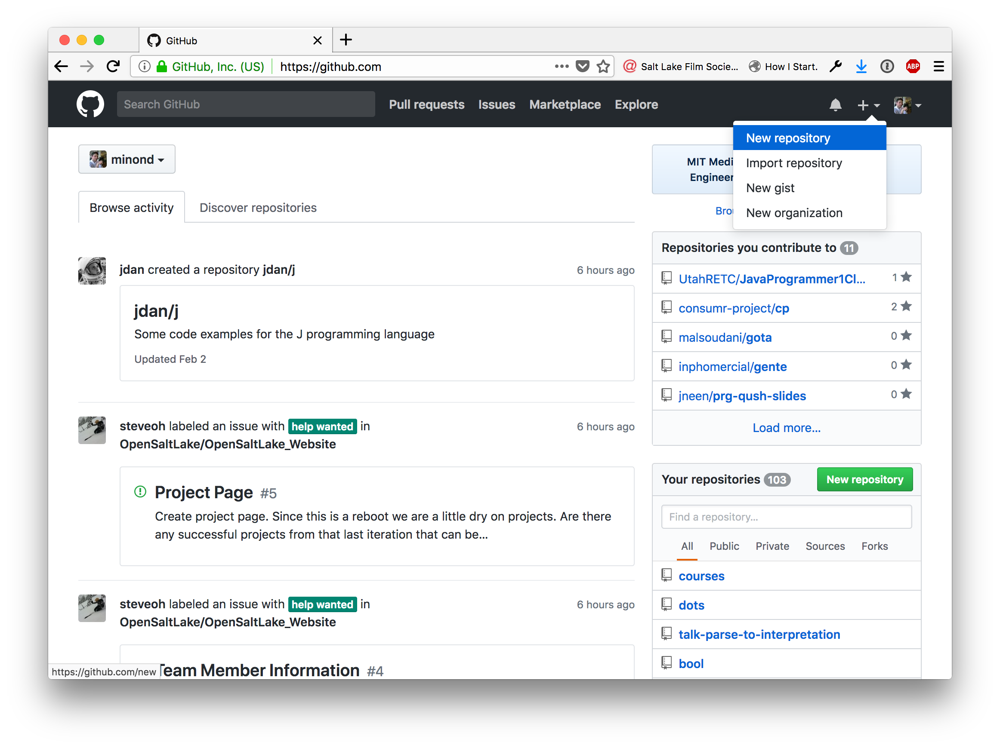
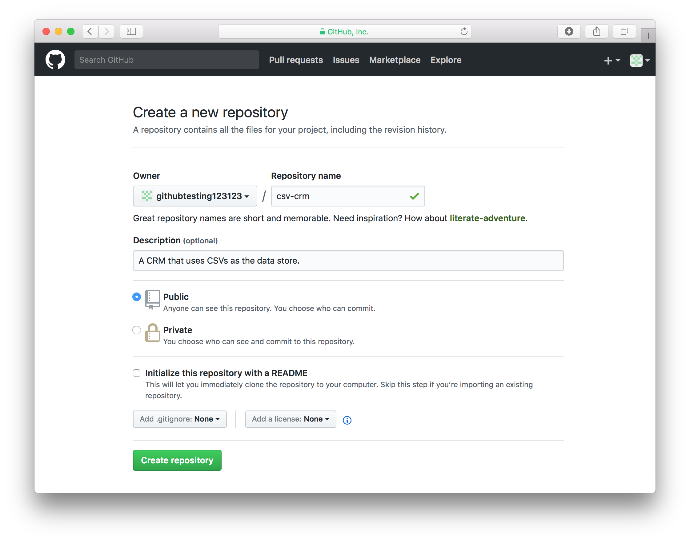

<!--
$theme: default
page_number: true
footer: Java Class - Project 1
-->

# Project 1 and intro to Git

- **Review of Previous Week**
- **Introduction to Git**
- **GitHub account creating**
- **Using Git and GitHub for this class**
- **Changes, changes, changes**
- **Homework**

-----------------------------------------------------------------------------

# But first a review of last week

```java
LocalDate d = LocalDate.now()
LocalTime t = LocalTime.of(13, 2, 10);

LocalDateTime dt = LocalDateTime.now();
LocalDateTime hourLater = dt.plusHours(1);

Period p = Period.of(1, 0, 7);
DateTimeFormatter f =
  DateTimeFormatter.ofLocalizedDateTime(
    FormatStyle.SHORT);
```

-----------------------------------------------------------------------------

# Introduction to Git

-----------------------------------------------------------------------------

# We're going to talk about the what, the why, and then the how.

-----------------------------------------------------------------------------

# What is Git?

-----------------------------------------------------------------------------

# Git is Version Control software

-----------------------------------------------------------------------------

# What is "Version Control"?

-----------------------------------------------------------------------------

# New Terminology

==**Version Control**==: the task of keeping a software system consisting of many versions and configurations well organized. ~ Google [1]

-----------------------------------------------------------------------------

# Let's simplify some more.

-----------------------------------------------------------------------------

# Git

Git is a program that allows you to track updates in your code and easity share what you are working on. Git is heavily used in jobs and large projects, so we will use it to use to submit this and all future class projects.

-----------------------------------------------------------------------------

# Git (cont.)

- A better way to "undo" changes,
- A better way to collaborate than mailing files back and forth, and
- A better way to share your code with your teammates and the world.

-----------------------------------------------------------------------------

# Why?

-----------------------------------------------------------------------------

# A few reasons

1. This is a tool you'll use when you become a Software Developer.
2. Using Git allows you to store your code on GitHub (we'll get to that in a second.)
3. Storing your code on GitHub is good because:
    - it's a backup that shows a history of your work
    - more importanly it is a portfolio that shows off your work

-----------------------------------------------------------------------------

# What is GitHub?

GitHub is a site where you can host your code for free (after you create an account). It is a place where anyone can search, browse, download, and use Open Source software. It doesn't *run* your code, but it just *stores* it.

-----------------------------------------------------------------------------

# Are you familiar with Dropbox?

-----------------------------------------------------------------------------

# Think of Git + GitHub as Dropbox for your code

-----------------------------------------------------------------------------

# New Terminology

==**Open Source**==: A software project (however big or small) that has made their code freely available for anyone to see.

A lot of the code that is powering the internet is Open Source software. Like, a lot. Open Source software is *extremely* important.

-----------------------------------------------------------------------------

# Let's start getting into the "how"

-----------------------------------------------------------------------------

# Git and GitHub can do a lot, but this is where we'll start:

- How to save your work in your own computer.
- How to save your work in your GitHub account.

-----------------------------------------------------------------------------

# Now we're going to do the following:

1. Install Git.
2. Signup for GitHub.
3. Create a space in your GitHub account and in your own computer to store the first project.
4. Learn the parts of Git that are important for you to know.

-----------------------------------------------------------------------------

# Installing Git

Go to https://git-scm.com/download and select the operating system that you're using. If you're on Windows, make sure you know if you have 32 or 64 bit versions. The next slides are screenshots of installing Git in Windows.

-----------------------------------------------------------------------------

# https://git-scm.com/download

-----------------------------------------------------------------------------



-----------------------------------------------------------------------------


-----------------------------------------------------------------------------


-----------------------------------------------------------------------------


-----------------------------------------------------------------------------


-----------------------------------------------------------------------------


-----------------------------------------------------------------------------



-----------------------------------------------------------------------------



-----------------------------------------------------------------------------


-----------------------------------------------------------------------------


-----------------------------------------------------------------------------


-----------------------------------------------------------------------------


-----------------------------------------------------------------------------


-----------------------------------------------------------------------------

# Now open your terminal and run `git`.
# What do you see?

-----------------------------------------------------------------------------



-----------------------------------------------------------------------------

# Configure Git

Let's give Git your name and email so that it knows who you are.

```
> git config --global user.name "FirstName LastName"
> git config --global user.email "YourEmailAddress"
```

-----------------------------------------------------------------------------

# Next let's create a GitHub account

Now that you have Git installed in your computer, we're going to create a GitHub account so that you can store your code in both your computer and online. Go to https://github.com to start the process.

-----------------------------------------------------------------------------

# https://github.com

-----------------------------------------------------------------------------


-----------------------------------------------------------------------------


-----------------------------------------------------------------------------


-----------------------------------------------------------------------------


-----------------------------------------------------------------------------


-----------------------------------------------------------------------------

After verifying your email we're going to create a repository for this week's homework assignment.

-----------------------------------------------------------------------------

# New Terminology

==**Repository**==: repositories are where you store your Git projects. They track all the code and have a history of every change that has been committed! 

A repository is just like a folder that holds one of your projects. You create a repository for different projects. Repositories can have many files and other folders in them.
You will want to get in the practice of creating a new repository for every project.

-----------------------------------------------------------------------------

We're going to create a new repository that you will own and use for this week's homework. Go to GitHub and follow the next slides.

-----------------------------------------------------------------------------



-----------------------------------------------------------------------------

- **Repository name**: java-class-git-homework

- **Description**: Repository for Git homework in my Introduction to Java Programming class.

- **Check "Public"**

- **Check "Initialize this repository with a README"**

- **Click "Create repository" button**

-----------------------------------------------------------------------------




-----------------------------------------------------------------------------


-----------------------------------------------------------------------------

# Let's download your new repository to your computer.

-----------------------------------------------------------------------------

Create a Projects folder in your computer, navigate to that folder in your terminal, and run the clone command.

-----------------------------------------------------------------------------

# Now let's talk about how we use Git

-----------------------------------------------------------------------------

# Git commands

- `git add`
- `git commit`
- `git push`
- `git status`
- `git clone`

-----------------------------------------------------------------------------

# `git add`

By default, Git does not care about every file in the repository. If you want Git to track changes you make to a file, you have to "add" it by running `git add <FILENAME>`.

Then, as you make changes to your files, you will also need to tell git which changes you are interested in keeping track of, by using `git add` on the files that have changed. This gives you fine tuned control over what changes you are committing to as you work.


-----------------------------------------------------------------------------

# `git commit -m "your commit explanation"`

Think of a commit as a snapshot of changes you have made to your code. Let's say we just finished adding a feature to our project, we would create a commit which basically packages all of those changes and formats them in a way that I can then share when the rest of my team or the rest of the internet.

When you commit you will also include a short explanation of the changes you made at the end. What you put between the quotes is up to you!

There is no limit to the number of commits you make! The only requirement is that there is at least one character change in a file that Git is tracking.

-----------------------------------------------------------------------------

# `git push`

Committing your updates doesn't mean they'll be shared with others that have access to the repository.

To share these changes with everyone else, you have to "push" your commits. The command `git push` takes the commits that only exist locally (on your computer) and pushes them to the remote Git server (GitHub.com).

-----------------------------------------------------------------------------

# `git status`

This simple command will give you information about the current state of your repository. With this command you can see which files are untracked by Git, which tracked files have modifications, and also which files you have recently started tracking with Git.

When you create a new commit, Git will put all changes and new files in the commit and so they will not show up when you run `git status`, but what you will see is that there is a local commit that needs to be pushed (with `git push`.)

-----------------------------------------------------------------------------

# `git clone`

This command downloads a repository to your computer. You need to clone a repository before you can make any changes to it on your computer.

-----------------------------------------------------------------------------

`git add`: Use this command to tell Git to start tracking the changes you make to a file. Example: `git add HelloWorld.java`

`git commit`: Use this command once you are done with a set of updates to your code and you are ready to package them so that you can share them with others. `git commit -m "Fixing a bug"`

`git push`: Use this command to make your commits available to the rest of your team. Example: `git push origin master`

`git status`: Use this command to get information about your repository. Tells you what files Git is not tracking and which ones you have modified.

`git clone`: Use this command to download a copy of a repository to your own computer. Only need to do this once.

-----------------------------------------------------------------------------

```bash
> # After you cloned your repo and cd into the folder
> git status
> git add Calculator.java
> git add Main.java
> git commit -m "Finished the Calculator homework"
> git push origin master
```

-----------------------------------------------------------------------------

# Lab #1: add a file to your repository and push it to GitHub.

-----------------------------------------------------------------------------

# Lab #2: make a change to that same file and push the update to Github.

-----------------------------------------------------------------------------

# Lab #3: follow at least one of your classmates.

-----------------------------------------------------------------------------

# Changes, changes, changes

-----------------------------------------------------------------------------

# Let's review this week's homework

-----------------------------------------------------------------------------

# Reference list

[1] https://www.google.com/search?q=define+version+control&ie=utf-8&oe=utf-8&client=firefox-b-1-ab
